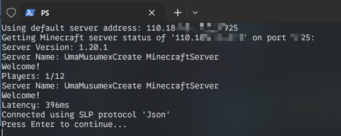

### Minecraft Status 

# Minecraft 服务器状态检查

此 PowerShell 脚本使用 MineStat 模块检查 Minecraft 服务器的状态。

## 前提条件

- PowerShell 5.1 或更高版本 (在终端中运行`$psversiontable.psversion`可以查看当前PS版本)

## 安装 & 使用 
* Windows 

右键单击`main.ps1`后选择"以Powershell运行"，按照提示操作即可。

你也可以在脚本同目录下创建一个名为"address.txt"的文件（注意后缀），写入你的服务器地址和端口，如`1234.67.89.25565`。这样每次无需重复输入即可查询服务器状态。

