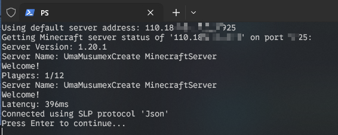

### Minecraft Status 

# Minecraft Server Status Check

This PowerShell script checks the status of a Minecraft server using the MineStat module.

## Prerequisites

- PowerShell 5.1 or later

## Installation & Usage
* Windows

Right-click on `main.ps1` and select "Run with PowerShell", then follow the prompts.

You can also create a file named "address.txt" (make sure the extension is correct) in the same directory as the script, and enter your server address and port, like `1234.67.89.25565`. This way, you can check the server status without having to input the address each time.
